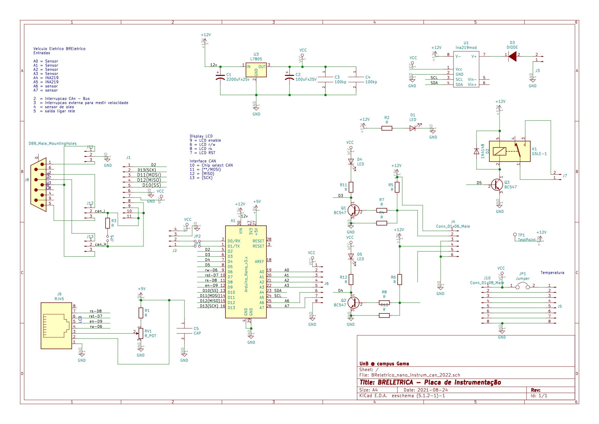
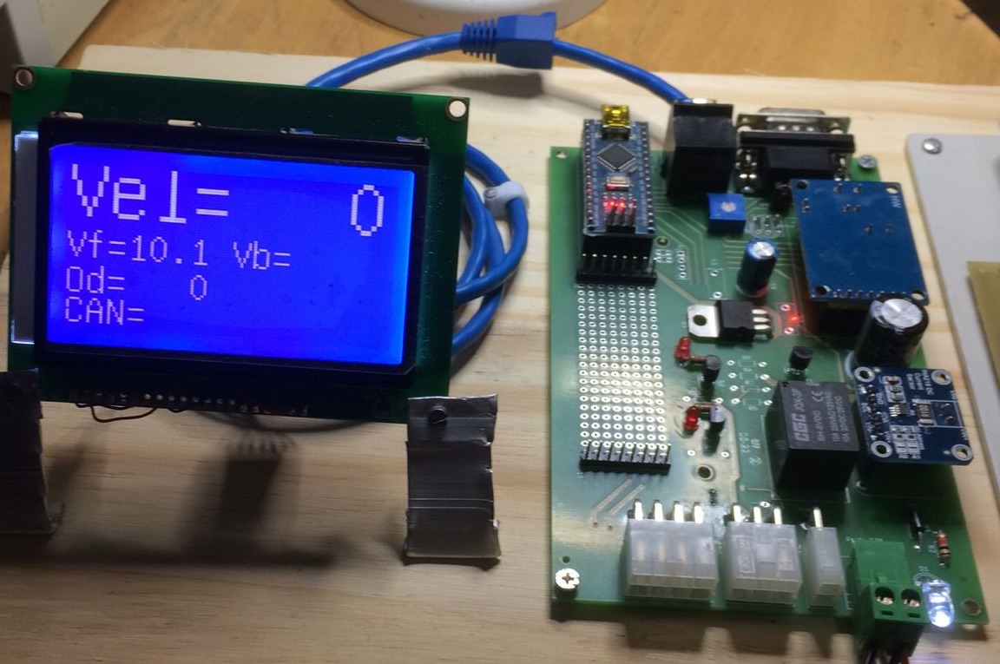
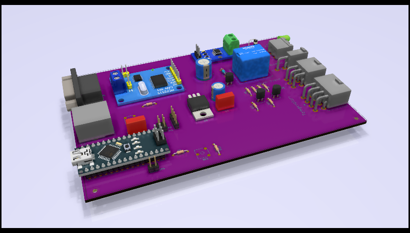
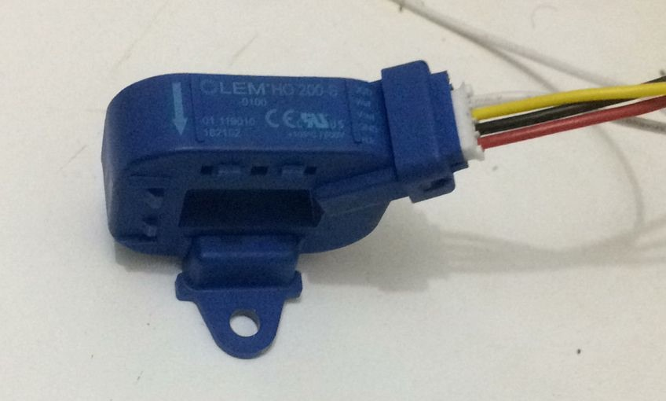
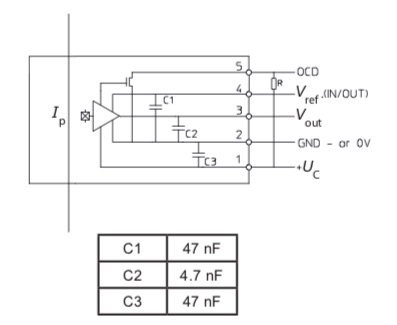
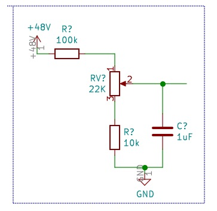
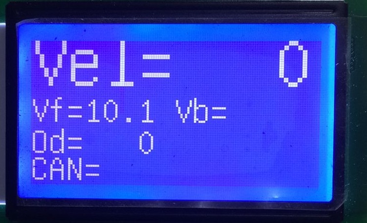

# Módulos de instrumentação 

`Documentos/GitHub/Modulo-instrumentacao`

# 1. Apresentação 
Este módulo tem como função monitorar os sensores de temperatura do sistema de arrefecimento, os sensor de velocidade das rodas e monitorar o sensores relativo ao funcionamento do sistema de freio, e disponibiliza os valores no barramento CAN.

O módulo foi desenvolvido originalmente para o BR800 e pode ser adaptada para as necessidades da Van.

No caso do BR800 o sistema tem as seguintes funcionalidade.

- Sáida display LCD 128x64 com os dados para o motorista;
- Monitoramento de velocidade do veículo por meio de sensor de rotação na roda dianteira;
- Monitoramento da temperatura do sistema de arrefecimento e comandar a bomba elétrica de circulação da água;
- Monitoramento de nível do óleo de freio;
- Monitoramento da tensão de 12v do carro;
- Monitoramento do consumo do próprio módulo,

A primeira versão para o BR800 tinha que trabalhar com 12V e 24V por causa do contator de potência que trabalhava em 24v. 
Isso deu muito problema e o projeto agora vai usar somente 12Volts para todos os subsistemas. 

O mesmo hardware também vai ser usado para implementar o computador do bordo do carrinho de Golfe.

No caso da VAN deve ter mais funcionalidades, pois poderá incorporar as demandas do sistema de servo-freio. 

# 2. Hardware

O diagrama de blocos mostra as entradas e saídas deste novo modulo de instrumentação.


## 2.1. Esquema elétrico 

O esquema elétrico da placa de instrumentação versão fev/2022 está mostrado a seguir.



A placa de circuito impresso montado com o display (versão fev/2022) está mostrada a seguir.



A placa de instrumentação foi montada para permitir alguns ajustes de hardware ao longo do seu desenvolvimento e a versão fev/2022 contem:

1. Saída para display LCD
2. Controlador CAN
3. Entrada para sensor indutivo de velocidade
4. Entrada de sensor presença de óleo de freio
5. Medidor do próprio consumo de energia com INA219
6. 6 entradas ou saidas analógicos ou digitais
que podem ser montados conforme necessidade no matriz contatos
7. Saída com rele


O módulo pode ser alojado numa caixa padrão Patola PB114 com conectores específicos para cada funcionalidade, com pinagem diferenciados para evitar trocas. Os conectores para display, alimentação 12 volts, CAN também são padronizadas. 




Na parte de traz a placa tem a entrada para programar o arduino nano, o conector para o RJ45 para o dislay, interface CAN enquanto na parte de frente a placa tem as entradas para alimentação de 12Vdc, saída para o rele e as entradas dos sensores separadas em dois conectores. O conector J4 Minifit 6 pinos é destindao para o sensor de velocidade e o sendor de nível de óleo.
O conector J5 minifit de 8 pinos recebe as entradas programáveis.      

## 2.2. Conector CAN

O conector CAN segue o padrão do projeto com o DB9 macho na placa. Pinagem do conector DB9 macho pode ser ajustado para dois tipos de padrões das ligações CAN. Essa escolha é feito por meio de estrapes (ou ligaçoes soldados) na placa de circuito impresso nos jumpers J12 e J13.
A pinagem configurada na placa é mostrada na tabela a seguir.

| pino	| função |
|-----|---------|
|  2  | CAN-L |
|  7  | CAN-H |
|  3  | GND   |

Se for necessário pode se trocar a pinagem para seguir o padrão usado no OBDII.


Da mesma forma que o módulo de luzes, a comunicação usa o MCP2515 que está ligado por meio da interface SPI ao microcontrolador Arduino.

## 2.3. Conector Display LCD
A primeira versão da placa de instrumentação tinha um conector mini DIN de 8 vias. 
Este conector se mostrou muito difícil de soldar e comprar, por isso se optou em usar um conector RJ45 que é amplamante usado no mercado.

Pinagem do conector RJ45 para ligar o LCD.

| RJ45 | 	função LCD |	Origem |
|---|--------|-------------|
| 1 | GND    | Fonte       |  
| 2 | Vcc    | Vcc do Arduino | 
| 3 | Vo     | Trimpot     |
| 4 | RW     | D6 Arduino  |
| 5 | Enable | D9 Arduino  |
| 6 | Reset  | D7 Arduino  |
| 7 | RS     | D8 Arduino  |
| 8 | sem uso | sem uso    |


## 2.1. Medidor de velocidade

O medidor de velocidade está implementado por meio de um sensor indutivo contador de pulso.
Este contador de pulsos está ligado no BR800 no cabo do velocimetro que originalmente ia diretamente para o painel. O mostrador origal era um trandutor mecânico que mostrava a velocidade no painel. 

O cabo do velocímetro entre diretamente no sensor que transforme a rotação em pulsos.  


O sensor é alimentado com 12 volts e a sua sáida é do tipo coletar aberto, permitindo uma interface simples na placa do módulo de instrumentação. 

A saída do sensor de velocidade é do tipo coletor aberto NPN. 
Os pinos 1,2, e 3 do conector J4 ligam o sensor

| J2| 	função |	Sensor   |
|---|--------|------------|
| 1 | 12V    | cor do fio |  
| 2 | Sinal  | cor do fio |
| 3 | GND    | cor do fio |

## 2.2. Sensor de nível de oleo de freio

O sensor de óleo de freio é um contato aberto montado na tampa do reservatório de óleo.
Ele compartilha o conector J2 conforme a pinagem mostrada na tabela a seguir.

| J2| 	função |	Sensor   |
|---|--------|------------|
| 4 | 12V    | cor do fio |  
| 5 | Sinal  | cor do fio |
| 6 | GND    | cor do fio |

## 2.3. Sensor de corrente

O sensor de corrente que está sendo usado no GamaGolfe é um sensor da LEM conforme mostrado na figura a seguir.
Este sensor será ligada em uma das entradas analógiacas do conector J5 



O sensor é alimentado com 5 volts e a sua sáida é um sinal analógico de xxx a xxx volts. 

Os pinos 1,2, e 8 do conector J5 ligam o sensor

| pino sensor LEM| função | cor fio  |
|:--------------:|--------|----------|
| 1 | 5V     | vermelho |
| 2 | GND    | preto    |
| 3 | Sinal corrente | amarelo|
| 4 | Vref   | branco   |


[Datasheet do sensor de corrente](https://www.lem.com/sites/default/files/products_datasheets/ho_50_250-s-0100_series.pdf)





O conector J5 ainda aloja os outros sensores.

| J5| função | cor fio  | Arduino |
|---|--------|:--------:|:-------:|
| 1 | 5V     | vermelho | Vcc     |
| 2 | Sinal corrente | amarelo  | A0 |
| 3 | Vref   | branco | ? 
| 4 | tensão 48Vcc | ? | A7 |
| 8 | GND    | preto    | GND|

## 2.4. Transdutor de tensão da bateria de tração (48Vcc)

O circuito que condiciona e atenua a tensão de 48Vcc é mostrado a seguir.




## 2.5. Controle de temperatura

O circuito de arrefecimento aproveita o radiador original do veículo adaptada para a nova configuração. O diagrama blocos a seguir mostra o circuito.


O módulo monitora os sensores de temperatura analógicos LM35 que estão insatalados no circuito de arrefecimento do motor elétrico e seu controlador. A partir da informação da temperatura o módulo comanda o ligamento da bomba circulação de água deste circuito. A bomba pode ser acionado por uma tensão de 12V configurada na placa. 


# 3. Implementação da programação

A programação do modulo de instrumentação pode ser dividido em vários rotinas que rodam parelela no Arduino.

Os requisitos do tempo de atualização dos variaveis foram obtidas da documentação do Protoloc J1939, que define esses tempos para a maioria das variáveis.

O repositório local do programa de controle é 

`Documento/GitHub/Modulo-instrumentacao`

e repositório remoto está no link 

[https://github.com/rudivels/BREletrica\_Sensor\_CAN\_Lcd\_Velocidade\_temperatura](https://github.com/rudivels/BREletrica_Sensor_CAN_Lcd_Velocidade_temperatura) 

## 3.1. Rotina de controle de arrefecimento 
Essa rotina de controle de arrefecimento tem por função monitorar a temperatura e comandar a bomba de circulação quando a tempratura passa de um valor de controle. 

A rotinta tem duas entrada que são lidos a uma taxa de 1Hz: 

- temperatura 1 (analógico) a cada 1000 ms
- temperatura 2 (analógico) a cada 1000 ms

Ainda não tem uma definição exata onde vão ser instalados os sensores de temperatura, mas pretende-se colocar um na saída de água do motor e outro na saída da água no controlador do motor.

A saída é o relé que liga a bomba de circulação de água.

Além disso, a rotina disponibilizará os seguintes dados para comunicação via CAN

- temperatura 1 (analógico) 1 byte, 0-100 graus Celcius
- temperatura 2 (analógico) 1 byte, 0-100 graus Celcius
- bomba ligada (bit)
- Alarme de temperatura 1 alta (bit)
- Alarme de temperatura 2 alta (bit)

## 3.2. Rotina de medir a velocidade do veículo

Essa rotina mede a velocidade da roda dianteira por meio de um sensor tipo contador de pulso, muito usado em sistema de taximetros.


A rotina precisa atualizar os dados de velocidade do veículo a cada 100 ms, e a maneira mais simples de implementar a leitura é por meio de uma rotina de tratamento de interrupção. 

Havera a necessidade de avaliar a forma de medição quando o carro está andando a baixa velocidade ou alta velocidade.

Essa rotina também vai ser responsável para fazer o registro do odômetro, e gravar esses valores numa memória não volátil no próprio Arduino.


A rotina disponibilizará os seguintes dados para comunicação CAN:

- velocidade (analógica) 2 bytes, 0-120 km/h 
- quilometragem (analógica) 2 byte, 0-10000 km 


A rotina de medir velocidade por enquanto so calcula e encaminha a quantidade de pulsos por intervalo de tempo gerados pelo sensor de velocidade. 
Numa primeira calibragem feito em 2018/09/13 do odometro levantou-se que (210-170=) 40 pulsos correspondiam a uma Distancia 8,3 metros.

Cada pulso corresponde a um deslocamento  1 pulso = 8,30 / 40 = 0,2075 metro.

Se a taxa de amostragem será de 100 ms, então uma mudança de pulsos neste intervalo, correponderá numa mudança de 0,2075 m / 0,1s =  2,075 m/s ou 7,47 km/h.

Ou seja, a menor variação que pode ser medida com este sensor e mandado pelo barramenento CAN a cada em 100 ms será de aproximadamente 7,5 km/h, pois com este método não se pode medir quantidade de pulsos fracionados. 

Deve se avaliar se uma outra maneira de calcular a velocidade fica melhor, por exemplo de medir o tempo entre pulsos e depois fazer a conversão para velicidade em Km/h.

Caso for medir o tempo entre pulsos em (inteiro) milisegundos perde se precisão nas velocidades mais altas, mas ganha nas velocidades baixas:  

* 120km/h - 0,006225 segundos ou 6ms 
* 119km/h - 0,006277 segundos ou 6ms
* 100km/h - 0,007470 segundos ou 7ms
* 2 km/h -  0,3735 segundos ou 373ms
* 1 km/h -  0,7470 segundos ou 747ms

A velocidade em km/h ficará em V = 747/( tempo em milisegundos) 

## 3.3. Monitoramento de potência e consumo

A rotina de medição de potência e consumo avalia a cada segundo a tensão, a corrente elétrica e a potência elétrica e a energia consumida pelo módulo. O componente centrar é o INA219.

As entradas são 

- tensão 12 v (analógica), 1 byte, 0-20V
- corrente 12v (analógica), 1 byte, 0 - 5 Amp

As saídas da rotina são as mesmas das entradas acrescidas de 

- potência 12v (analógica), 1 byte , 0-100W
- Consumo acumulada 12v, 2 bytes, 0 - 1000kWh
- Alarme tensão baixa 12v, bit 


## 3.3. Rotina do mostrar os dados no painel

A rotina de mostrar os dados no painel, fará a atualização do display a uma frequência de no mínino 3 hz.

O dado em destaque será a velocidade, e em seguida, tensão de 12 volts e a maior temperatura do sistema de arrefecimento.

Como se trata do principal visor de informação do veículo, será preciso fazer um design apropriada para permitir a visualização rápido da informação mais importante e uma série de alarmes para chamar a atensão do motorista em casos críticos.

Nem toda informação medido pelo módulo será mostrado no painel.

- Velocidade em km/h;
- Valor da temperatura;
- Alarme de servo freio;
- Alarme de temperatura;
- Indicação de bomba de agua ligada;
- Indicação de bomba de vacuo ligada;
- Alarma de óleo de freio;

O painel, também vai monitorar alguns dados no barramento CAN e organizar e disponibilizar estes dados no painel.

A primeira versão do display é 


## 3.4. Rotina de controle do hidro-vácuo-elétrico
Uma futura versão da placa para a VAN terá a função de controlar a bombda de vácuo do servo freio. 

Entradas:

- Pressão do servo freio
- Velocidade 

Saída:
  
- Comando da bomba de vácuo 
- Sinal de alarme do servo freio;

O controle de hidro-vácuo tem que também receber do barramento CAN a informação do luz de freio, para poder verificar o funcionamento da efetividade do servo freio. 


# 4. Comunicação J1939

A rotina de comunicação J1939 terá diversos tipos de mensagens com prioridades e tempo de envios diferentes.

A configuração do CAN e Timer é mostrado no trecho a seguir.

```
#include <SPI.h>
#include <mcp2515.h>
#include <SPI.h>
#include <mcp2515.h>

int tempor_can1=0;
int tempor_can2=2;

void setup(void) 
{ 
 MsTimer2::set(100, BaseDeTempo); // dezimo segundos
 MsTimer2::start();
 mcp2515.reset();
 mcp2515.setBitrate(CAN_125KBPS,MCP_8MHZ);
 mcp2515.setNormalMode(); 
}

void BaseDeTempo(void)
{
 tempor_can1++;
 tempor_can2++;
} 

```

## 4.1 Velocidade da roda

A primeira mensagem e com maior prioridade é a velocidade da roda.

Cosegui descobrir que Database CAN DBC do velocidade da roda é. 

| PGN | 65215 (0xFEBF)|
|:-----|:------:|
| Prioridade | 6 |
| Comprimento | 8|
| Tx rate | 100 ms|

| Byte | Descrição | PGN | 
|:----:|-----------|-----|
| 1-2 | Fronte axle spreed | 904 |
| 3 | Relative, fronte axle #1, left | 905 |
| 4 | Relative, front axle #1, right | 906 |
| 5 | Relative, rear axle #1, left | 907 |
| 6 | Relative, rear axle #1, right | 908 |
| 7 | Relative, rear axle #2, left | 909 |
| 8 | Relative, rear axle #2, right | 910 |


Ainda não está claro como montar a partir do PGN o ID da mensagem.

Vamos supor que o Source Adress (SA) é `0x90`

Então a parte final do ID será `0xFEBF90`

pegando a primeira parte da estrutura de mensagem do controlador do motor elétrico que é  `0x90`

Juntando isso o message ID fica em 

`0x90FEBF90`  ou  `2432614288`.

No nosso caso vamos implementar somente a medição da velocidade das rodas dianteiras. 

No dicionário de dados DBC a descrição fica

```
BO_ 2432614288 MODINSTRUM: 8 Vector__XXX
 SG_ Velocity : 0|16@1+ (1,0) [0|120] "km/h" Vector__XXX
 
CM_ BO_ 2432614288 "Modulo de instrumentacao";
CM_ SG_ 2432614288 Velocity "Velocidade da roda dianteira "; 
```

O trecho do código que implementa isso no loop principal do programa no Arduino é:

```
if (tempor_can1 >= 5)  // a cada 0.1 segundos
 {
  tempor_can1=0;
  canMsg1.can_id = 0x10FEBF90 | CAN_EFF_FLAG;  //  testando com 0x90FEBF90 tambem funcionou
  canMsg1.can_dlc = 8;
  canMsg1.data[0] = (Velocidade_Int & 0x00FF);  
  canMsg1.data[1] = (Velocidade_Int >> 8) & 0x00FF;
  canMsg1.data[2] = 0xFF;
  canMsg1.data[3] = 0xFF;  
  canMsg1.data[4] = 0xFF;  
  canMsg1.data[5] = 0xFF;  
  canMsg1.data[6] = 0xFF; 
  canMsg1.data[7] = 0xFF;
  mcp2515.sendMessage(&canMsg1);
 }
```

O programa foi implementado e testado.

## 4.1. Tensão e corrente da bateria principal e auxiliar

Ainda não descobri qual PGN padrão para implementar este monitoramento e por isso vamos aproveitar o mesmo usado pelo controlador do motor CC brushless do BR800.

O dicionário de dados está também no `/home/debian/sc/DBC/BRELETmotorV2.dbc`


```
BO_ 2416478878 EVEC2: 8 Vector__XXX
 SG_ Voltage : 0|16@1+ (0.1,-1000) [0|500] "v" Vector__XXX
 SG_ Current :16|16@1+ (0.1,-1000) [-500|500] "A" Vector__XXX
 SG_ Temperature :32|8@1+ (0.1,40) [0|100] "A" Vector__XXX
 SG_ Forward  :40|1@0+ (1,0) [0|0] "-" Vector__XXX
 SG_ Backward :41|1@0+ (1,0) [0|0] "-" Vector__XXX 
 SG_ Brake    :42|1@0+ (1,0) [0|0] "-" Vector__XXX 
 SG_ Stop     :43|1@0+ (1,0) [0|0] "-" Vector__XXX 
 SG_ Ready    :46|1@0+ (1,0) [0|0] "-" Vector__XXX 
```
Trecho implementado no arduino. 

Tem que tomar cuidado para não mandar as duas mensagens um atras do outro sem o devido atraso entre as duas mensagens. 
A rotina em Python no OBC (Beagle) não foi capaz de processa-lo em tempo hábil. 
Pode ser que com o uso de filtros configurado no própro controlador can o processamento fica melhor, mas é prudente dar o devido delay entre as mensagens. 


```
if (tempor_can2 >= 5)  // a cada 0.5 segundos
 {
  tempor_can2=0;
  canMsg1.can_id = 0x10088A9E | CAN_EFF_FLAG; 
  canMsg1.can_dlc = 8;
  canMsg1.data[0] = (Voltage_Int & 0x00FF);  
  canMsg1.data[1] = (Voltage_Int >> 8) & 0x00FF;
  canMsg1.data[2] = (Current_Int & 0x00FF); 
  canMsg1.data[3] = (Current_Int >> 8) & 0x00FF;  
  canMsg1.data[4] = 0xFF;  
  canMsg1.data[5] = 0xFF;  
  canMsg1.data[6] = 0xFF; 
  canMsg1.data[7] = 0xFF;
  mcp2515.sendMessage(&canMsg1);
 }
```


## 4.3. Temperatura do motor

Falta ainda descobrir o detalhamento desse PGN.

Os outros valores serão que precisamos descobrir o PGN são:
 
- sensor MAP (analógico)  100 ms 
- Sensor nível de oleo freio (digital) 1000 ms
- Temperatura do motor e controlador do motor
- Bomba de água ligado         1000 ms
- Bomba vacuo ligado           100 ms

