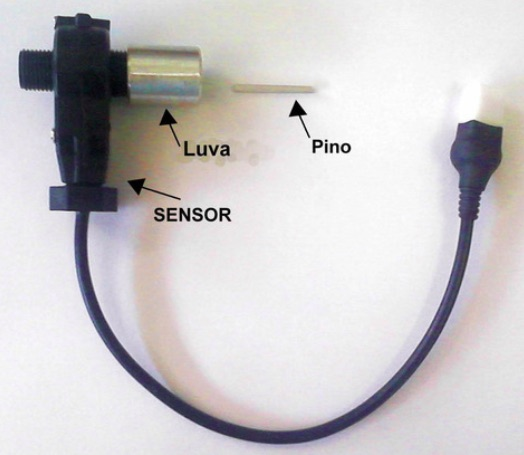

# Módulos de instrumentação 

`Documentos/GitHub/Modulo-instrumentacao`

# 1. Apresentação 
Este módulo tem como função monitorar os sensores de temperatura do sistema de arrefecimento, os sensor de velocidade das rodas e monitorar o sensores relativo ao funcionamento do sistema de freio, e disponibiliza os valores no barramento CAN.

O módulo foi desenvolvido originalmente para o BR800 e pode ser adaptada para as necessidades da Van.

No caso do BR800 o sistema tem as seguintes funcionalidade.

- Sáida display LCD 128x64 com os dados para o motorista;
- Monitoramento de velocidade do veículo por meio de sensor de rotação na roda dianteira;
- Monitoramento da temperatura do sistema de arrefecimento e comandar a bomba elétrica de circulação da água;
- Monitoramento de nível do óleo de freio;
- Monitoramento da tensão de 12v e 24v do carro;
- Monitoramento do consumo do próprio módulo,


No caso da VAN deve ter mais funcionalidades, pois poderá incorporar as demandas do sistema de servo-freio. 

# 2. Hardware

O diagrama de blocos mostra as entradas e saídas deste novo modulo de instrumentação.


O circuito de arrefecimento aproveita o radiador original do veículo adaptada para a nova configuração. O diagrama blocos a seguir mostra o circuito.


Este módulo tem por função monitorar a velocidade da roda por meio de um sensor magnética acoplado na roda do veículo. Este sensor fornece um trêm de pulsos proporcional à velocidade de roda. O sensor de óleo de freio é um contato aberto montado na tampa do reservatório de óleo e também é monitorado em intervalos regulares.
 
O módulo monitora 4 sensores de temperatura analógicos LM35 que estão insatalados no circuito de arrefecimento do motor elétrico e seu controlador. A partir da informação da temperatura o módulo comanda o ligamento da bomba circulação de água deste circuito. A bomba pode ser acionado por uma tensão de 24V ou 12V configurada na placa. 

 
O módulo monitora ainda a tensão e corrente da sua própria alimentação 12 Volts, e também monitora a corrente e tensão do circuito de 24Volts.  
Da mesma forma do módulo anterior, escolheu-se implementar este módulo usando Arduino e as figuras a seguir mostram o esquema eletrônico e a placa de circuito impresso.


Da mesma forma que o módulo de luzes, a comunicação usa o MCP2515 que está ligado por meio da interface SPI ao microcontrolador Arduino.
Os demais componentes do módulo são todos componentes discretos e há dois sensores de corrente ACS712 para monitorar o consumo do módulo.  


## 1.1. Alojamento e conexões

O módulo também será alojado numa caixa padrão Patola PB115 com conectores específicos para cada funcionalidade, com pinagem diferenciados para evitar trocas. Os conectores para display, alimentação 12 volts, CAN também são padronizadas. 


A foto na figura a seguir mostra a caixa PB115 com a proposta de placa de circuito impresso com na parte de frente os conectores de entrada dos sensores e saída de acionamento. Na parte de traz, entrada para programar o arduino nano, o conector para o dislay, interface CAN e alimentação de 12Vdc.     


### Conectores dos sensores de temperatura

### Acionamento da bomba de circulação

### Sensor de velocidade

### Sensores do subsistema de freio


### Conector CAN
A conexão com o barramento CAN é por meio de um conector DB9 macho seguindo o padrão do [Sparkfun  CAN Shield ](https://www.sparkfun.com/products/13262).

| pino | descrição |
|:----:|:---------:|
|   2  |   GND     |
|   3  |   CANH    |
|   5  |   CANL    |
|   9  |   12V     |


### Conector Display LCD
Conecor mini DIN. 

Pinagem do conector mini DIN femea para ligar o LCD.

| mini Din | 	função LCD |	Origem |
|----------|------------|---------|
|   | RS     | D7 Arduino  |
|   | RW     |D8 Arduino  |
|   | Enable | D9 Arduino |
|   | Reset  | D6 Arduino |
|   | Vcc    | Vcc do Arduino | 
|   | GND    | Fonte | 
|   | Vo     | Trimpot |


O modulo de instrumentação ainda precisa de algumas definições e por isso ainda não se implementou o hardware dedicado a ele. 

# 3. Implementação da programação

A programação do modulo de instrumentação pode ser dividido em vários rotinas que rodam parelela no Arduino.

Os requisitos do tempo de atualização dos variaveis foram obtidas da documentação do Protoloc J1939, que define esses tempos para a maioria das variáveis.

O repositório local do programa de controle é 

`Documento/GitHub/Modulo-instrumentacao`

e repositório remoto está no link 

[https://github.com/rudivels/BREletrica\_Sensor\_CAN\_Lcd\_Velocidade\_temperatura](https://github.com/rudivels/BREletrica_Sensor_CAN_Lcd_Velocidade_temperatura) 

## 3.1. Rotina de controle de arrefecimento 
Essa rotina de controle de arrefecimento tem por função monitorar a temperatura e comandar a bomba de circulação quando a tempratura passa de um valor de controle. 

A rotinta tem duas entrada que são lidos a uma taxa de 1Hz: 

- temperatura 1 (analógico) a cada 1000 ms
- temperatura 2 (analógico) a cada 1000 ms

Ainda não tem uma definição exata onde vão ser instalados os sensores de temperatura, mas pretende-se colocar um na saída de água do motor e outro na saída da água no controlador do motor.

A saída é o relé que liga a bomba de circulação de água.

Além disso, a rotina disponibilizará os seguintes dados para comunicação via CAN

- temperatura 1 (analógico) 1 byte, 0-100 graus Celcius
- temperatura 2 (analógico) 1 byte, 0-100 graus Celcius
- bomba ligada (bit)
- Alarme de temperatura 1 alta (bit)
- Alarme de temperatura 2 alta (bit)

## 3.2. Rotina de medir a velocidade do veículo

Essa rotina mede a velocidade da roda dianteira por meio de um sensor tipo contador de pulso, muito usado em sistema de taximetros.

Este contador de pulsos está ligado no BR800 no cabo do velocimetro que originalmente ia diretamente para o painel. O mostrador origal era um trandutor mecânico que mostrava a velocidade no painel. 

O cabo do velocímetro entre diretamente no sensor que transforme a rotação em pulsos.  



O sensor é alimentado com 12 volts e a sua sáida é do tipo coletar aberto, permitindo uma interface simples na placa do módulo de instrumentação. 

A rotina precisa atualizar os dados de velocidade do veículo a cada 100 ms, e a maneira mais simples de implementar a leitura é por meio de uma rotina de tratamento de interrupção. 

Havera a necessidade de avaliar a forma de medição quando o carro está andando a baixa velocidade ou alta velocidade.

Essa rotina também vai ser responsável para fazer o registro do odômetro, e gravar esses valores numa memória não volátil no próprio Arduino.

A rotina disponibilizará os seguintes dados para comunicação CAN:

- velocidade (analógica) 2 bytes, 0-120 km/h 
- quilometragem (analógica) 2 byte, 0-10000 km 

## 3.3. Monitoramento de potência e consumo

A rotina de medição de potência e consumo avalia a cada segundo a tensão e a corrente elétrica consumida pelo módulo. 

As entradas são 

- tensão 12 v (analógica), 1 byte, 0-20V
- tensão 24 v (analógica), 1 byte, 0-40V
- corrente 12v (analógica), 1 byte, 0 - 5 Amp
- corrente 24v (analógica), 1 byte, 0 - 5 Amp

As saídas da rotina são as mesmas das entradas acrescidas de 

- potência 12v (analógica), 1 byte , 0-100W
- potência 24v (analógica), 1 byte , 0-100W
- Consumo acumulada 12v, 2 bytes, 0 - 1000kWh
- Consumo acumulada 24v, 2 bytes, 0 - 1000kWh
- Alarme tensão baixa 12v, bit 
- Alarme tensão baixa 24v, bit

## 3.3. Rotina do mostrar os dados no painel

A rotina de mostrar os dados no painel, fará a atualização do display a uma frequência de no mínino 3 hz.

O dado em destaque será a velocidade, e em seguida, tensão de 12 volts e a maior temperatura do sistema de arrefecimento.

Como se trata do principal visor de informação do veículo, será preciso fazer um design apropriada para permitir a visualização rápido da informação mais importante e uma série de alarmes para chamar a atensão do motorista em casos críticos.

Nem toda informação medido pelo módulo será mostrado no painel.

- Velocidade em km/h;
- Valor da temperatura;
- Alarme de servo freio;
- Alarme de temperatura;
- Indicação de bomba de agua ligada;
- Indicação de bomba de vacuo ligada;
- Alarma de óleo de freio;

O painel, também vai monitorar alguns dados no barramento CAN e organizar e disponibilizar estes dados no painel.

## 3.4. Rotina de controle do hidro-vácuo-elétrico
Uma futura versão da placa para a VAN terá a função de controlar a bombda de vácuo do servo freio. 

Entradas:

- Pressão do servo freio
- Velocidade 

Saída:
  
- Comando da bomba de vácuo 
- Sinal de alarme do servo freio;

O controle de hidro-vácuo tem que também receber do barramento CAN a informação do luz de freio, para poder verificar o funcionamento da efetividade do servo freio. 


## 3.5. Comunicação J1939

A rotina de comunicação J1939 terá diversos tipos de mensagens com prioridades e tempo de envios diferentes.

### Velocidade da roda

A primeira mensagem e com maior prioridade é a velocidade da roda.

Cosegui descobrir que Database CAN DBC do velocidade da roda é. 

| PGN | 65215 (0xFEBF)|
|:-----|:------:|
| Prioridade | 6 |
| Comprimento | 8|
| Tx rate | 100 ms|

| Byte | Descrição | PGN | 
|:----:|-----------|-----|
| 1-2 | Fronte axle spreed | 904 |
| 3 | Relative, fronte axle #1, left | 905 |
| 4 | Relative, front axle #1, right | 906 |
| 5 | Relative, rear axle #1, left | 907 |
| 6 | Relative, rear axle #1, right | 908 |
| 7 | Relative, rear axle #2, left | 909 |
| 8 | Relative, rear axle #2, right | 910 |


Ainda não está claro como montar a partir do PGN o ID da mensagem.

Vamos supor que o Source Adress (SA) é `0x90`

Então a parte final do ID será `0xFEBF90`

pegando a primeira parte da estrutura de mensagem do controlador do motor elétrico que é  `0x90`

Juntando isso o message ID fica em 

`0x90FEBF90`  ou  `2432614288`.

No nosso caso vamos implementar somente a medição da velocidade das rodas dianteiras. 

No dicionário de dados DBC a descrição fica

```
BO_ 2432614288 MODINSTRUM: 8 Vector__XXX
 SG_ Velocity : 0|16@1+ (1,0) [0|10000] "km/h" Vector__XXX
 
CM_ BO_ 2432614288 "Modulo de instrumentacao";
CM_ SG_ 2432614288 Velocity "Velocidade da roda dianteira "; 
```


### Temperatura do motor

Falta ainda descobrir o detalhamento desse PGN.

Os outros valores serão que precisamos descobrir o PGN são:
 
- sensor MAP (analógico)  100 ms 
- Sensor nível de oleo freio (digital) 1000 ms
- Temperatura do motor e controlador do motor
- Bomba de água ligado         1000 ms
- Bomba vacuo ligado           100 ms

