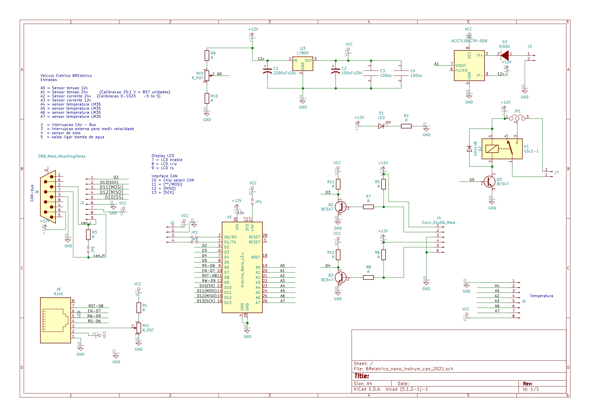

# Módulos de instrumentação e comando


O barramento CAN de baixa velocidade interliga:

- Módulo de controle de luzes e sinalização;
- Módulo de monitoramento de velocidade, temperatura e óleo de freio;
- Computador de Bordo.


# 1. Modulo de sensores de velocidade, temperatura e óleo de freio

A Van tem um sensor de velocidade acoplada na ???? e um sensor de nível de óleo de freio que foram incorporados no novo design de instrumentação do veículo. Além disso, o novo projeto deve monitorar a temperatura da água no circuito de arrefecimento do motor e controlador e comandar a bomda de circulação de água. O diagrama de blocos mostra as entradas e saídas deste novo modulo de instrumentação.


O circuito de arrefecimento aproveita o radiador original do veículo adaptada para a nova configuração. O diagrama blocos a seguir mostra o circuito.


Este módulo tem por função monitorar a velocidade da roda por meio de um sensor magnética acoplado na roda do veículo. Este sensor fornece um trêm de pulsos proporcional à velocidade de roda. O sensor de óleo de freio é um contato aberto montado na tampa do reservatório de óleo e também é monitorado em intervalos regulares. O módulo monitora 4 sensores de temperatura analógicos LM35 que estão insatalados no circuito de arrefecimento do motor elétrico e seu controlador. A partir da informação da temperatura o módulo comanda o ligamento da bomba circulação de água deste circuito. (pesquisar a opção de alimentar a bomba com 24Volts)

 
O módulo monitora ainda a tensão e corrente da sua própria alimentação 12 Volts, e também monitora a corrente e tensão do circuito de 24Volts.  
Da mesma forma do módulo anterior, escolheu-se implementar este módulo usando Arduino e as figuras a seguir mostram o esquema eletrônico e a placa de circuito impresso.


```
Falta trocar o D2 com D3 do Arduino para mantar a compatibilidade da biblioteca CAN do sparkfun can-shield.
```

Da mesma forma que o módulo anterior a comuicação usa o MCP2515 que está ligado por meio da interface SPI ao microcontrolador Arduino.
Os demais componentes do módulo são todos componentes discretos e há dois sensores de corrente ACS712 para monitorar o consumo do módulo.  




O módulo também será alojado numa caixa padrão Patola PB115 com conectores específicos para cada funcionalidade, com pinagem diferenciados para evitar trocas. Os conectores para display, alimentação 12 volts, CAN também são padronizadas. 



## Anotações

Atualizar algus detalhes nas placas:

- Alimentação 24V no rele da bomba
- Padronizar os trimpots de luminosidade no LCD
- Trocar D2 por D3 na conexão do arduino com o mcp2515 para manter compatibilidade com a biblioteca

[volta](https://github.com/Tecnomobele-FGA/Sobre-o-Tecnomobele)

[volta](../Sobre-o-Tecnomobele/README.md)
