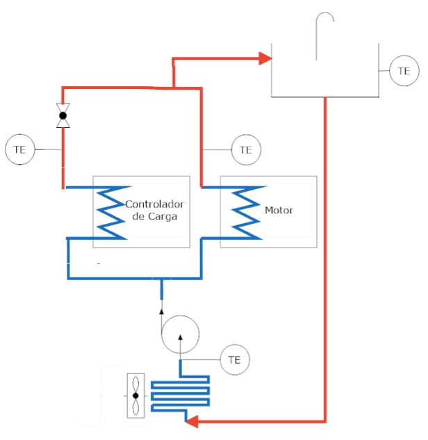

# Módulos de instrumentação 

`Documentos/GitHub/Modulo-instrumentacao`

Este módulo tem como função monitorar os sensores de temperatura do sistema de arrefecimento, os sensor de velocidade e o nível de óleo de freio, e disponibiliza os valores no barramento CAN.

O módulo foi desenvolvido originalmente para o BR800 e pode ser adaptada para as necessidades da Van.

A Van tem um sensor de velocidade acoplada na ???? e um sensor de nível de óleo de freio que foram incorporados no novo design de instrumentação do veículo. Além disso, o novo projeto deve monitorar a temperatura da água no circuito de arrefecimento do motor e controlador e comandar a bomda de circulação de água. O diagrama de blocos mostra as entradas e saídas deste novo modulo de instrumentação.

O circuito de arrefecimento aproveita o radiador original do veículo adaptada para a nova configuração. O diagrama blocos a seguir mostra o circuito.

Este módulo tem por função monitorar a velocidade da roda por meio de um sensor magnética acoplado na roda do veículo. Este sensor fornece um trêm de pulsos proporcional à velocidade de roda. O sensor de óleo de freio é um contato aberto montado na tampa do reservatório de óleo e também é monitorado em intervalos regulares. O módulo monitora 4 sensores de temperatura analógicos LM35 que estão insatalados no circuito de arrefecimento do motor elétrico e seu controlador. A partir da informação da temperatura o módulo comanda o ligamento da bomba circulação de água deste circuito. A bomba pode ser acionado por uma tensão de 24V ou 12V configurada na placa. 

 
O módulo monitora ainda a tensão e corrente da sua própria alimentação 12 Volts, e também monitora a corrente e tensão do circuito de 24Volts.  
Da mesma forma do módulo anterior, escolheu-se implementar este módulo usando Arduino e as figuras a seguir mostram o esquema eletrônico e a placa de circuito impresso.

Da mesma forma que o módulo anterior a comuicação usa o MCP2515 que está ligado por meio da interface SPI ao microcontrolador Arduino.
Os demais componentes do módulo são todos componentes discretos e há dois sensores de corrente ACS712 para monitorar o consumo do módulo.  

## Alojamento e conexões

O módulo também será alojado numa caixa padrão Patola PB115 com conectores específicos para cada funcionalidade, com pinagem diferenciados para evitar trocas. Os conectores para display, alimentação 12 volts, CAN também são padronizadas. 

A foto na figura a seguir mostra a caixa PB115 com a proposta de placa de circuito impresso com na parte de frente os conectores de entrada dos sensores e saída de acionamento. Na parte de traz, entrada para programar o arduino nano, o conector para o dislay, interface CAN e alimentação de 12Vdc.     

## Conector CAN
A conexão com o barramento CAN é por meio de um conector DB9 macho seguindo o padrão do [Sparkfun  CAN Shield ](https://www.sparkfun.com/products/13262).

| pino | descrição |
|:----:|:---------:|
|   1  | 
|   2  |   GND     |
|   3  |   CANH    |
|   4  |
|   5  |   CANL    |
|   6  |
|   7  |
|   8  |
|   9  |   12V     |

## Conector Display LCD
Uma possibilidade é de usar um conector DB9 fêmea para ligar o módulo com o display, tomando o cuidado de não usar os pinos já usados pelo CAN. Outra opção é usar um conecor mini DIN. 

[volta](https://github.com/Tecnomobele-FGA/Sobre-o-Tecnomobele)

[volta](../Sobre-o-Tecnomobele/README.md)
